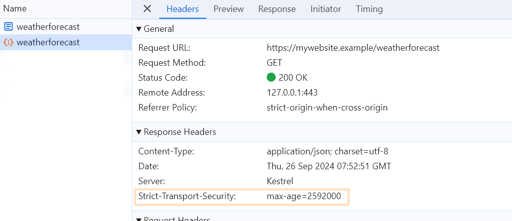

Enforcing HTTPS and how it works under the hood

> 💡 .NET will be used to provide examples
>
> In this article, I will use an ASP.NET Core app for practical examples. However, the content is platform-agnostic, so you should be able to replicate the examples in your preferred language or framework. Only the relevant code for ASP.NET Core will be shown, while endpoint configuration details are omitted to enhance readability.

# Why Do We Use HTTPS?

Nowadays, an increasing number of communications occur over the HTTPS protocol. HTTPS is an end-to-end encrypted protocol, as the communicating parties first negotiate the encryption and configure it properly `before exchanging any data`.

# What Is HTTPS Redirection?

The first step in enforcing HTTPS is HTTPS redirection. This technique redirects all HTTP requests to a separate port that is configured to listen for HTTPS traffic. The standard status code for this redirection is `307 Temporary Redirect`, which allows requests to be redirected while preserving the original HTTP method, ensuring that no data is lost in the process.

A brief ASP.NET Core configuration example is given below: 

```csharp
var builder = WebApplication.CreateBuilder(args);
var app = builder.Build();
app.UseHttpsRedirection();
```

Navigating to `http://mywebsite.example/weatherforecast` will lead to redirection to `https://mywebsite.
example/weatherforecast` with `307 Temporary Redirect` 


But, as always, there’s one issue: the very first request is redirected on the `server side`, which opens up the 
possibility for `Man-in-the-Middle` (MITM) attacks.

> 💡 Is there a way to prevent this by having the browser handle the redirection instead of relying on the server?

# HSTS kicks in!

Another step toward securing our apps and enforcing HTTPS is the use of HTTP Strict Transport Security (HSTS). The core idea behind HSTS is that it adds a special response header to the first successful HTTPS request, containing specific directives. The `Strict-Transport-Security` HTTP header signals to the browser that all subsequent requests should be automatically redirected to HTTPS on the browser side.

> 💡 So, what is the improvement?
>
> Only the first request made by the browser will use plain HTTP. This request will be redirected to HTTPS using HTTPS redirection, and then the HSTS header will be sent in the response to inform the browser that all future requests should always use HTTPS.

# Let's check this process

> 💡 A tricky task
> 
> This may be challenging to check this process with ASP.NET Core locally because `UseHsts` middleware excludes 
> `localhost` 
> and 
> `127.0.0.1`

## Overcome limitations

Since some capabilities are missing for HSTS for ASP.NET Core served at `localhost`, there some workaround steps are 
needed:

- add a custom domain name into `hosts`
  > Open `C:\Windows\System32\Drivers\etc\hosts` and add the following line: `127.0.0.1 mywebsite.example`. This 
  > will help to overcome limitations
- create and install a self-signed certificate
    > This is needed since browser will recognise and take an action based on the HSTS header only if the 
  > HTTPS connection is 
  > set and secured properly    
- configure APS.NET Core app to use the newly created certificate
    ```csharp
    var builder = WebApplication.CreateBuilder(args);
    
    string certPath = "Path to mywebsite.pfx";
    string certPassword = "YourPassword";
    
    builder.WebHost.ConfigureKestrel(serverOptions =>
    {
        serverOptions.Listen(IPAddress.Loopback, 80);
        
        serverOptions.Listen(IPAddress.Loopback, 443,
             listenOptions =>
        {
            listenOptions.UseHttps(certPath, certPassword);
        });
    });
    
    var app = builder.Build();
    
    app.UseHttpsRedirection();
    app.UseHsts();  
    ```
- provide application urls in `launchSettings.json`
    > `"applicationUrl": "https://mywebsite.example;http://mywebsite.example"`

## Check the result

After completing all the prerequisite steps, we can finally check the outcome:

- Request `http://mywebsite.example`. It will be regularly redirected to `https://mywebsite.example` with `307 
   Temporary Redirect`.

    

- Check that https request sets the `HSTS` header

    

- Request `http://mywebsite.example` one more time. It will be redirected to `https://mywebsite.example` but the 
   redirection will happen on the `browser side` with `307 Internal Redirect`

    

This means, that now browser knows that it should use HTTPS to request `mywebsite.example` and redirects all HTTP calls on its own.


> 💡 Can we improve this?
>
> Our configuration so far requires at least one HTTP call that may be unwanted as well.

# But wait. How this works with `github.com`?

Let’s imagine you have a freshly installed system, and you open your browser for the very first time. Try navigating to http://www.github.com. Surprisingly, you’ll notice that even this initial request is already redirected to HTTPS!


This is exactly what we were looking for! But how did the browser know to perform this redirection in advance?

The missing piece of the puzzle can be found at the [core of Chromium engine](https://source.chromium.org/chromium/chromium/src/+/main:net/http/transport_security_state_static.json) where thousands of domains with preconfigured HSTS are listed. This list is used by all Chromium-based browsers and is continuously updated.

To add your domain to this list, or to check if it’s already included, you can visit  [hstspreload.org](https://hstspreload.org/).

For a website to be eligible for this list, it must meet certain requirements. In ASP.NET Core, this can be configured as follows:

```csharp
builder.Services.AddHsts(options =>
{
    options.Preload = true;
    options.IncludeSubDomains = true;
    options.MaxAge = TimeSpan.FromDays(730);
});
```

> 💡 **Preload** directive changes nothing for browser
> 
> Adding this directive is used as a conventional agreement to reflect that the admin is okay with preloading.

# Check browser configuration and revert changes

Open `chrome://net-internals/#hsts` at Google Chrome.

This page allows you to check built-in domains configured for HSTS, as well as custom ones added dynamically. Here, you can either check or remove `mywebsite.example`.


# Summary

At this article we briefly described:

- Why to enforce HTTPS?
- What is `HTTP Redirection`?
- What is `HSTS`?
- What how to avoid any HTTP calls?
- What is the difference between `307 Temporary Redirect` and `307 Internal Redirect`
- What is HSTS preloading?
- How to add your website to `Chromium HSTS preloading list`?

# References
[Enforce HTTPS in ASP.NET Core](https://learn.microsoft.com/en-us/aspnet/core/security/enforcing-ssl?view=aspnetcore-8.0&tabs=visual-studio%2Clinux-sles)

[RFC6797](https://datatracker.ietf.org/doc/html/rfc6797)

[HSTS in Chromium](https://www.chromium.org/hsts/)

[List of preloaded domains](https://source.chromium.org/chromium/chromium/src/+/main:net/http/transport_security_state_static.json)

