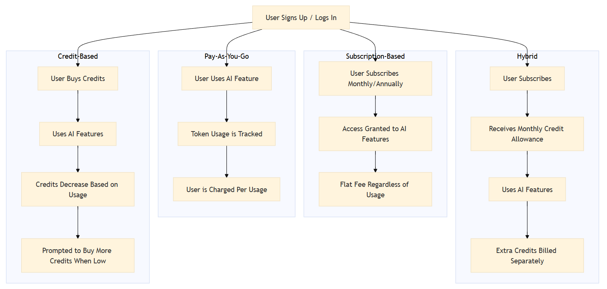
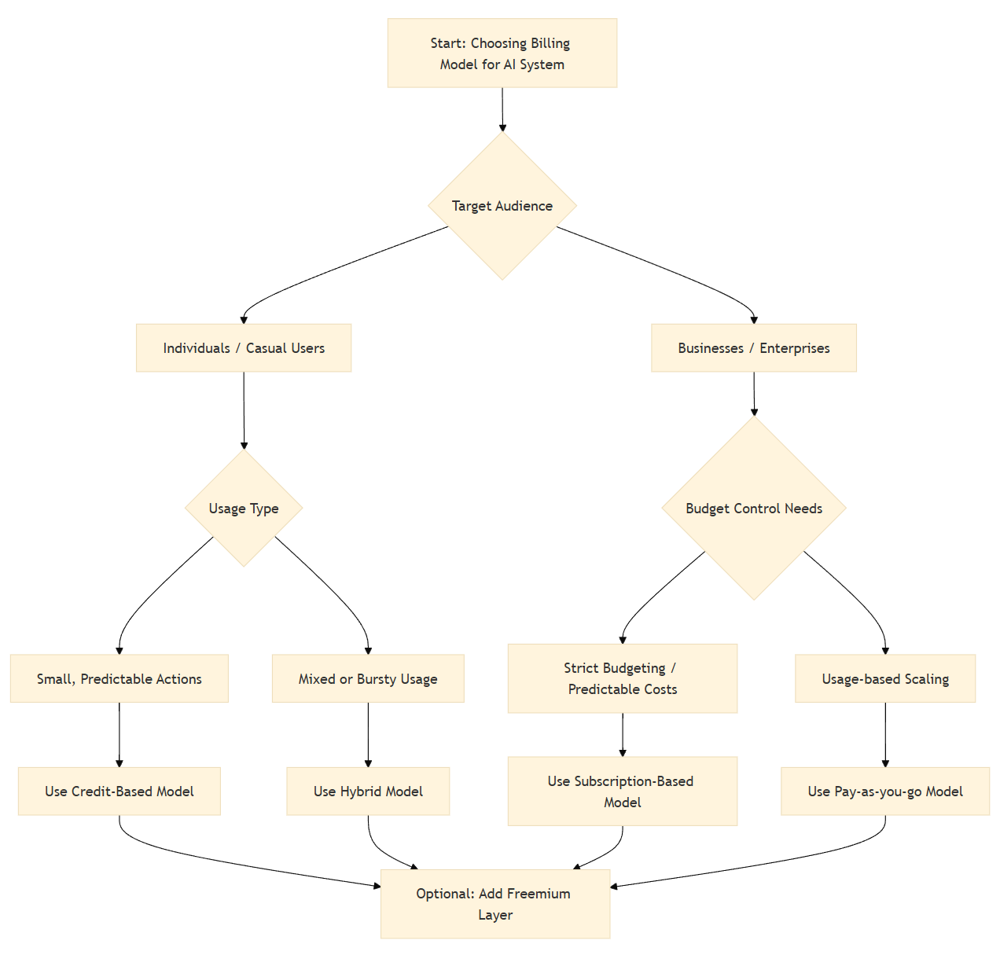

One of the essential questions to address during the initial system design is the billing model.

Whether you're building a traditional application or introducing AI-powered features, it's important to consider how your services will be billed. Ideally, the billing model should be both flexible and predictable - for users and for the service provider. However, choosing the right model requires a tailored analysis based on domain-specific factors and the characteristics of your target audience.

As AI-powered features become increasingly popular, they introduce new billing challenges that must be addressed to ensure the system remains cost-effective and sustainable.

> 💡 AI features often depend on external APIs (e.g., OpenAI, Claude, etc.) with usage-based pricing. This makes the billing problem much more pressing than in traditional apps.

While many variables may influence your billing strategy, understanding the core billing models - and how they can be combined is fundamental. The four primary billing models for AI-powered systems are:

- Credit-based model
- Pay-as-you-go model
- Subscription-based model
- Hybrid Subscription-Credit model

An overview of these models is illustrated below:

> 💡 Different billing models might better serve different user types (e.g., hobbyists vs enterprise clients).

## Credit-based model

The key idea behind this model is the use of **upfront payments** from users. Users purchase a set of credits (e.g. coins, points, etc.), which are then used to pay for specific actions within the system.

The flexibility of this approach allows you to assign different credit costs to different actions. For example, each step in a longer AI-agent workflow can be priced individually (e.g. "generate AI image = 5 credits", "summarize document = 2 credits").

A potential pitfall of this model is billing for long or complex operations. When it's difficult to estimate an operation's complexity in advance, users may run out of credits mid-process. This can lead to a poor user experience - a problem that may be mitigated by combining this model with other billing approaches.

> 💡 You need to have a solid vision on what happens when a credit runs out mid-operation: does it fail gracefully? Is partial output returned? This is critical to user trust.

This model is ideal for small atomic operations, especially if the target audience consists mostly of individual users. This may seem more attractive to them to have a well-known limited upfront budget.

How to track credit usage in practice? Normally you will need to add an additional middleware into your system that will aggregate usage of tokens or compute time. This component may be introduced into the infrastructural layer of the system between business logic that calls the AI-provider.

## Pay-as-you-go model

This model can be seen as the opposite of the credit-based approach. It is widely adopted by cloud service providers and is typically their default billing model. The core idea is simple: "use first, pay later."

Similarly to the credit-based model you will need to track user usage of resources and then bill them according to predefined rates. This approach ensures that users will not run out of their credit in case of extended services usage.

> 💡 If you're using a third-party AI provider, you can bill users based on the actual cost of the AI services plus your own margin.

However, the present model may sometimes lead to pitfalls:

- Since there’s **no predefined budget limit**, it’s important to help users estimate their potential expenses. This typically requires either detailed documentation or dedicated tools such as pricing calculators.
    > 💡 Some concrete examples of utility services for price estimation are: [OpenAI Tokenizer](https://platform.openai.com/tokenizer), [Azure Pricing Calculator](https://azure.microsoft.com/en-us/pricing/calculator/), [AWS Calculator](https://calculator.aws/#/)

- This model works well for enterprise solutions with structured budgets and planned expenditures. However, if your target audience is primarily individual users, they may be wary of **unpredictable charges** after entering their credit card details.

## Subscription-based model

The idea behind a subscription is simple: pay once and use the service without limits for a fixed period of time. This is often the easiest model for users to understand and accept. Since there are no individual usage-based bills, there's no need to track resource consumption per user.

However, determining a sustainable and profitable subscription price can be tricky - especially when the cost of delivering AI-powered services varies significantly.

> 💡 A subscription-based billing model provides the most predictable revenue stream. It allows you to clearly forecast income based on the number of active users and their activity trends.

A poorly designed subscription plan can result in under- or over-utilization relative to your AI API usage. Heavy users, in particular, may significantly increase your backend costs. To manage this, it’s important to monitor user activity and consider implementing soft usage limits or rate limiting mechanisms to protect the system.

> 💡 From my experience, users tend to be less tolerant of downtime under a paid subscription. A subscription often creates a sense of ownership, rather than simply renting access. This can lead to higher expectations for SLA compared to, for example, credit-based models.

## Hybrid subscription-credit model

Users pay a monthly subscription that includes a base number of credits. Additional credits can be purchased as needed.

This model is quite flexible and convenient for users since every single subscription includes a transparent number of actions (e.g. generations, API calls, flow executions etc.). Users will have a clear vision, how to extend the subscription limits to satisfy their increased needs.

Additional benefits from your side

- Predictable recurring revenue.
- Accommodates variable user demand (system handles heavy users spikes)

At the same time the system requires a component that will track usage of subscription and additional credit purchased. This may increase the overall system complexity. 

> 💡 This model is especially effective for SaaS platforms with high backend variability, where a pure subscription model could be exploited by power users.

> 💡Consider implementing dashboards or notifications to support users and prevent surprises.

## Freemium

To make your product more attractive to users and increase its competitiveness, it's important to offer some form of free access. This allows users to explore the core features, and evaluate product's value before committing financially.

Naturally, the feature set available in the freemium tier should be limited. If too much functionality is provided for free, there's a risk that users will remain in the free tier without converting to paying customers.

This approach is not a standalone billing model, but rather a complementary strategy that can be added to any of the core models described earlier.

> 💡 Balancing features across tiers can be challenging. The free tier should offer just enough value to demonstrate what the product can do - but still encourage users to upgrade and become part of your paying audience.

> 💡 Make sure you track conversion funnel metrics (e.g. trial → paid conversion rate). This is a critical KPI for any product that includes free trial access.

# Summary

Selecting the right billing model is important for any product, but for AI-powered solutions, it's especially critical to ensure the system is financially sustainable.

Many factors can influence this decision, so a thorough analysis is necessary. The most important criteria are your target audience and the nature of the services you provide. It's best to make this decision as early as possible, since the billing model can significantly influence your system architecture and design choices.

